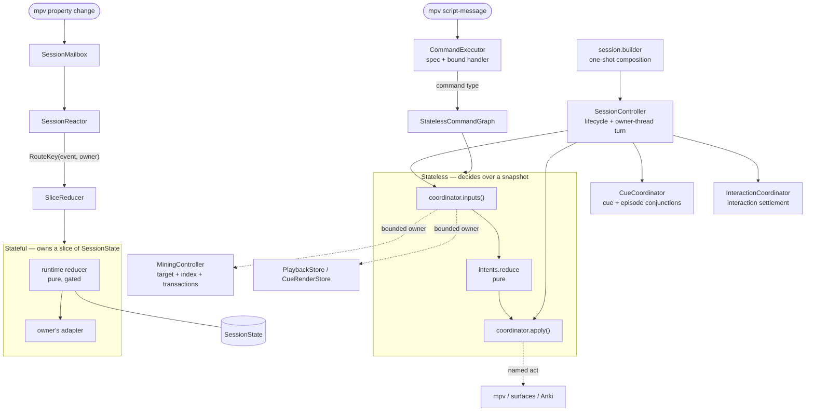

# Architecture

## What this is

`saitenka` renders Yomitan `structured-content` (styled CJK text with ruby/furigana) as an
image, composited directly into mpv's own OSD surface via `overlay-add` — one surface, no second
window, so it survives fullscreen and sidesteps the Windows airspace/MPO bugs a second window would
hit. Beyond the renderer, the codebase bolts a full reader onto mpv: subtitle draw with per-word
hitboxes, hover → dictionary lookup → tooltip, word coloring by known/frequency/JLPT state, and
one-key Anki mining.

Design strategy: "simplest tool first, escalate on limits" (see README's Escalation ladder).
Pillow remains the dictionary-panel and standard-subtitle rasterizer. The optional native-visible
subtitle mode uses libass only for offscreen token geometry; it does not replace the panel renderer.

## Module map

All shipped Python lives under one import namespace, `src/saitenka/`. The directories below are
internal modules with explicit dependency contracts, not independently published distributions.

- **`sc/`** — the renderer-neutral Yomitan `structured-content` input model. Kept PIL-agnostic
  (enforced by `.importlinter`); `render/sc_adapter.py` maps it into renderer-owned layout blocks.
- **`render/`** — layout/flow: the text walker, ruby positioning, line wrapping, panel chrome.
  `render.flow` is the core. `render/window.py` is the PIL-free geometry kernel (block offset table +
  half-open visible-range) and `render/banded.py` the **windowed (banded) tooltip engine**
  (`WindowedPanel`): render only the blocks in the viewport±overscan, retain heights/hit-geometry past
  pixel eviction (each retained block zlib-compressed), composite O(viewport) — pixel-identical to a
  `render_panel` crop. It is the **sole tooltip compositor** — every popup (base / nested / kanji /
  search) is a `Panel` (`app/features/tooltip/popups.py`) wrapping one `WindowedPanel`.
- **`draw/`** — rasterization primitives that paint the laid-out content.
- **`raster/`** + **`panel/`** — define the one-shot raster contract and compose the final RGBA
  panel image. `app/render_backend.py` is the characterized Pillow implementation; the interactive
  tooltip still uses `WindowedPanel` directly because its incremental viewport protocol is richer
  than `RasterBackend`. `panel.model` owns
  `Definition`/`Entry`; `panel.rows` plans deferred rows; `panel.body` owns picklable definition-body
  workers; and `panel.compose` owns full and viewport-first composition. `body_block.py` is a
  compatibility import for pre-package callers, not a second implementation.
- **`parallel.py`** — the CPU-bound-render executor policy: free-threaded threads (FreeType releases
  the GIL and faces are thread-local), process-pool fallback on a GIL build. Sub-interpreters are out
  because PIL's C extension is not safe across them.
- **`mpvio/`** — the mpv IPC bridge: JSON-IPC transport (`ipc.py`), mpv/ffmpeg discovery
  (`discover.py`), pushing panels into mpv's OSD surface (`osd.py`).
- **`subtitles/`** — the pure subtitle seam: immutable cues and authored events, lossless ASS semantic
  spans and fail-closed token-color rewriting, SRT/ASS/VTT parsing, cue navigation, and provider-neutral
  geometry request/snapshot contracts. `app/subtitle_pipeline.py` owns the generation fence that decides
  whether a result may still be published; `app/subtitle_geometry_job.py` owns the lane queue, lookahead,
  and result cache that reserve against it. Pillow remains the default; the opt-in external-ASS path
  wires `LibassGeometryBackend` while leaving mpv as the visible owner.
  It has no application, rendering, mpv, or filesystem dependencies; `app/sub_index.py` is the thin
  file-loading adapter. The corpus and differential checks therefore exercise the stable surface
  without constructing a `SessionController`.
- **`app/`** — the application layer. `app/session/controller.py` is the owner-thread shell: it owns
  mpv mutation and cross-feature ordering, while `app/features/` packages own feature state and
  policy. Tooltip interaction and tooltip preparation have separate bounded controllers under the
  tooltip feature package; profile, mining, analysis, cue-annotation, and translation-reveal
  controllers likewise live under their corresponding feature packages.
  `app/interaction/` contains shared lower-level interaction contracts; it has no runtime dependency
  on features or session composition. `app/session/` owns assembly, routing, lifecycle, and explicit cross-feature
  conjunctions. These directions and the declared feature-package inventory are gated.
  `app/runtime/` owns the closed command table; `app/session/assembly.py` installs pre-controller
  feature owners and their declarations; `app/session/factory.py` is the production construction seam.
  `cli.py` owns process setup and Cyclopts registration, `commands/` owns domain command surfaces and
  attach orchestration, and
  `launch/` owns run orchestration. The remaining domains include `tokenizer.py` (the tokenizer-strategy
  seam) over `tokenize.py` (fugashi/unidic-lite JP segmentation) and `tokenizer_latin.py` (the Latin
  strategy); `profiles.py`/`features/profiles/profile_cli.py`/`languages.py` define reading-profile
  values and loading (a French profile ships today), while the profile feature owns command
  admission and application; `dictionary.py`/`dictdb.py`/`lookup.py` (the consolidated SQLite
  dictionary DB); `scoring.py`/`wordlists.py`/`fsrs.py` (word coloring);
  `anki.py` plus `features/mining/` (mining + optional word-pronunciation audio);
  `features/analysis/` plus `render/analysis.py` (cached whole-track metrics and their background UI);
  `features/annotation/` (cue annotation identity, work, cache, and degradation policy);
  `session_stats.py` (event aggregation and asynchronous local history, reusing analysis snapshots);
  `jimaku.py`/`tsukihime.py`/`subtitle_providers.py` (subtitle fetching).
- **`runtime/`** — the session runtime: closed events/effects, bounded mailbox lanes with reserved
  terminal capacity, a deterministic lifecycle ledger, named timers, the owner slices, and
  `SessionLoop`, which drives the session off the mailbox. It knows nothing about `app/`; the edge
  runs one way. The [runtime architecture](docs/contributing/runtime.md) describes its relationship
  to `SessionController` and the maintained invariants.
- **Root leaf modules** — dependency-neutral types and policies shared across layers live directly in
  `saitenka` rather than a generic `utils` package: `model.py`, `bgra.py`, `fonts.py`, `mask_atlas.py`,
  `otel_metrics.py`, `parallel.py`, `resources.py`, `session.py`, and `version.py`. A root module should
  stay a cohesive leaf; a growing subsystem gets a package named for its intent.
- **`../saitenka-dict/`** — the renderer-neutral dictionary boundary: archive validation/import,
  SQLite lookup, semantic term/kanji models, and all five Yomitan result modes.
  `app/source_adapter.py` presents it by default through the stable Saitenka tooltip/card facade; the
  legacy facade is the compatibility fallback. The headless-Yomitan oracle is repository-only test
  tooling and is excluded from published artifacts.
- **`../ankiconnect-client/`** — the application-neutral AnkiConnect transport/retry/protocol client.
  `app/anki.py` retains Saitenka launch policy, telemetry, compatibility exceptions, and note building.
- **`../libasslite/`** — an independently versioned experimental PyO3 binding for copied libass image
  layers. It dynamically loads libass 0.17.x and is loaded only by the opt-in subtitle-geometry
  adapter; the default Saitenka package and Pillow path do not require it.
- **`../libasslite-bundle/`** — an optional platform wheel containing libass and its native runtime
  closure. It is discovered by `libasslite`, not imported by Saitenka, and stays outside the
  Apache-2.0 core distribution with its own notices and corresponding-source archives.
- **`app/known_cache.py`** — the disposable known-word cache in `anki-known.sqlite`; dictionary imports
  and schema rebuilds no longer own Anki-derived state.

## Composition and extension seams

The process entry point does not construct the reader graph itself. The assembly path is:

```
cli.create_app
  -> app.commands.<domain>
     -> run: app.launch.run -> app.session.factory.create_session_controller(...)
     -> attach: app.commands.attach -> app.session.factory.create_session_controller(...)
        -> build_session_assembly(...)
        -> build_session_graph(...)
        -> SessionController(graph)
```

mpv script messages go through a closed `CommandExecutor`: a declared spec per command (owner,
whether it needs a current cue) separate from the bound handler, so ordering and ownership are
testable without a session. `SessionAssembly` contributes independently assembled handlers;
`StatelessCommandGraph` binds the remaining messages to typed policies and purpose-specific
capabilities. `session.builder` composes the graph; `SessionController` owns the live lifecycle and
the owner-thread turn, settling the cue and interaction coordinators after each drain. Feature state
and policy stay in bounded owners. This is an internal composition seam, not an open third-party
plugin API.

A feature joins the session on one of two layers, and which one follows from whether it needs a
place to remember that does not exist yet.

- **Stateful** — it owns a slice of `SessionState`, and `reduce(state, event)` returns the next
  state plus effects.
- **Stateless** — it is a pure policy over a snapshot, `reduce(command, inputs)`. Routing that
  through the mailbox would add sequencing to a decision with nothing to sequence.

Both join through typed registration rows. Stateless inputs read bounded owners such as playback,
tooltip, picker, or cue presentation stores. Cross-feature operations are named acts; replaceable
episode state is reached through `EpisodeSlot`. Which files, and in what order, is
[Adding a feature](docs/contributing/runtime.md#adding-a-feature).



The asymmetry is lifetime, not authority. Stateful features store facts in an owner slice;
stateless policies sample existing owners for one synchronous command. Both keep decisions pure.
Impure coordinators may reach only the owners and named acts declared by their capability value.
The command graph rejects missing policies and messages, and its composition rejects deferred
session reads.

**The known cost.** A capability can still become too wide while remaining type-correct.
`poe arch-map` prints each capability's state owners and acts as review evidence; width is not an
arbitrary numeric build gate.

`saitenka.runtime` is a production package, not a separate contract: `session_routes.py` imports it,
and a session with a gateway is driven by `SessionLoop` off the mailbox rather than by a poll. See
[Interactive runtime architecture](docs/contributing/runtime.md) for both runtime packages, their
actual call boundaries, and the executable invariants.

The extension points have different maturity levels; keeping that distinction explicit prevents a
protocol-shaped class from being mistaken for production swappability.

| Capability | Boundary | Current status |
| --- | --- | --- |
| Dictionary semantics | `saitenka_dict.LookupSource` | Live: `DictionarySourceAdapter` is the default; the legacy facade is a fallback. |
| Subtitle acquisition | `SubtitleProvider` registry | Live: built-ins register capabilities and ordered fetch functions without provider branches in callers. |
| Tokenization | profile tokenizer strategy | Live: Japanese and Latin strategies are selected by the reading profile. |
| Session commands | `CommandRegistration` + `CommandExecutor` | Explicit and unit-testable; independently assembled handlers and the closed stateless command graph join once. |
| Stateful features | `StatefulBinding` + owner plan | Live for `Owner.INTERACTION`: one declaration supplies runtime reducers, no-runtime stores, accepted events, and explicit feature order; the reducer remains pure by gate. |
| Stateless features | `StatelessBinding` + `StatelessCommandGraph` | Live: command type and script message close independently; coordinators receive bounded owners and named acts, never the session controller. |
| Session events and effects | `saitenka.runtime` | Live: the mailbox is the session's ingress, `SessionLoop` drives it, and effects return as correlated terminals. |
| Full-panel raster | `RasterBackend` | Characterized by the Pillow adapter; the incremental tooltip path is not yet replaceable through it. |
| Subtitle geometry | `GeometryBackend` | Experimental: external authored ASS can use native-visible libass geometry; geometry degradation removes only interaction boxes while mpv retains pixel ownership. |

`render/`, `subtitles/`, and `panel/` are internal package boundaries in the Saitenka distribution.
`saitenka-dict`, `ankiconnect-client`, and experimental native add-ons are independently published.

## Interactive startup and cue annotation

Dependency construction already runs outside the reader loop. Publication swaps the completed
collaborators on the owner thread, then `CueAnnotationController` admits work to one priority worker;
the no-runtime seam resolves through the same owner synchronously. The work key identifies reusable semantics, while a
separate cue waiter carries timing and presentation identity, so the same computation can serve a
newer current cue without allowing an old result to restore stale interaction.

```text
dependency loader ──> publish collaborators ──> annotation generation
                                                │
cue change ──> retire tokens/boxes ──> plain or mpv-authored pixels
                                                │
             CURRENT ────────────────┐          │
             LOOKAHEAD ──────────────┼─> one annotation worker
             EPISODE ────────────────┘          │
                                                v
                                  identity-qualified result
                                    │                 │
                                  stale             current
                                    │                 │
                                 discard       tokens/styles
```

The early tokenizer warm has a retained completion handle. The annotation worker waits for it before
its first tokenizer call, preventing two concurrent initializations; demo and screenshot sessions use
the same coordinator but deliberately wait before hovering or capturing. Native subtitle geometry
lookahead also resolves tokenization through this worker rather than creating another annotation path.
The controller exposes a frozen `AnnotationView`; consumers sample it through a narrow protocol rather
than receiving the mutable cache or closures back into `SessionController`.

Startup readiness is independent of cue readiness. `run` owns an asynchronous mpv breadcrumb request;
`attach` owns none. After observers and key bindings are installed, the first successful full poll marks
the session interactive and submits at most one correlated asynchronous clear. Request IDs route late or
out-of-order mpv replies to their own futures, so cosmetic OSD feedback cannot stall or poison a later
command. `saitenka trace-report` summarizes these phases and annotation queue/work time from the normal
report bundle using a text-free field allow-list.

## Native-visible subtitle architecture

The experimental mode changes **who owns subtitle pixels**, not the tokenizer, lookup, tooltip, or
mining pipeline. mpv continues to render the authored external ASS track. Saitenka shadow-renders a
color-annotated copy off screen only to recover token geometry; that copy is never displayed.

```text
authored external .ass
│
├─ visible path ──────> mpv ──> mpv's libass ──> authored subtitle pixels
│
└─ interaction path ─> exact active frame + tokenizer spans
                       │
                       ├─ match mpv's active ASS rows to authored events
                       ├─ inject a unique color per paintable token into an in-memory copy
                       ├─ libasslite ──> selected libass ──> public ASS_Image layers
                       ├─ color pixels ──> TokenGeometry[]
                       └─ identity/generation gate ──> CueRenderStore.boxes
                                                      ├─ hover focus box
                                                      └─ normal lookup/tooltip/mining path
```

This preserves the features Saitenka owns while keeping visible typography as close to mpv as the
public APIs allow. The geometry request carries the ordered active-event identities, timestamp, frame and
storage sizes, pixel aspect, frame margins, authored-ASS margin policy, accepted mpv render profile,
rewritten ASS bytes, and token palette.
`LibassGeometryBackend` consumes only that provider-neutral contract and returns copied rectangles;
native pointers never escape `libasslite`.

The current accepted envelope is deliberately static and bounded. Simultaneous static events share
one frame identity and palette; whitespace/control-only tokens stay in semantic tokenization without
requiring pixels. Known unsupported inputs—animated or unmatchable ASS, unsupported source encodings,
missing source bytes, attached/custom fonts, and rejected mpv render settings—clear unproved hit boxes
without changing the pixel owner. Provider failures do the same; interaction returns only after a valid
identity-qualified snapshot publishes. Saitenka never displays its ID-colored shadow render. It cannot inspect
mpv's exact libass build and font environment, so the separately selected geometry runtime may still
differ at pixel level inside that envelope; the [user guide](docs/usage/native-subtitles.md#current-supported-envelope)
documents this experimental limitation.

### Lifecycle, lookahead, and stale-result rejection

Geometry is produced on cue or render-space changes, not on hover. Hover focus and tooltip scrolling
reuse the published boxes, so their 60 FPS interaction target does not imply a 60 FPS libass render.
The present static envelope also does not require video-frame-rate geometry updates.

```text
one drained mpv event batch / source / profile change
          │
          v
resolve complete active-frame observation
          │
          ├─ incomplete/unsupported/failed ──> mpv pixels + no unproved boxes
          │
          └─ complete ──> invalidate generation + current frame ─┐
                           next frames ─> bounded lookahead queue ─┤
                                                       v
                                         one geometry worker
                                                       │
                              build exact request ──> cache/libass
                                                       │
                                                       v
                       generation + track + frame + time + variant checks
                                                       │
                                      stale ──> discard │ publish ──> tick
                                                       │
                                                       v
                                      CueRenderStore.boxes + native focus overlay
```

The main loop drains related mpv property changes before making one geometry decision. The worker
never reads mpv IPC or mutates visible state. `SubtitleModeCoordinator` owns generation,
request sequencing, result identity, and provider errors. `SubtitleGeometryWorker` owns one current
slot plus bounded result and prefetch caches; `LibassGeometryBackend` owns the renderer LRU. Lookahead
is speculative and a miss is safe. Only the main tick installs boxes or clears interaction. Source,
cue, tokenizer/profile, render-space, and close transitions invalidate the generation, so an in-flight
result cannot be rebound after its inputs change. Source, frame, token, copied-bitmap, and active-row
ceilings bound native allocation and Python extraction before a result can publish.

Pixel ownership is a separate pure state machine. Selection helpers never write subtitle visibility.
The ownership executor serializes visibility assertions, legacy staging, retries, overlay suspension,
and close-time restoration. Once mpv ownership is admitted it survives cue, source, profile, tokenizer,
render-space, cache, and provider transitions. Legacy pixels can be committed only after a current
assert-true/readback-false transaction proves native pixels absent for a nonempty selection; unknown
results retry after 50/250/1000 ms and never authorize a legacy upload. The legacy base is staged before
that catastrophic commit, so ownership cannot pass through an intentionally blank state.

### Optional native packages

The binding and native closure are separate so users can prefer the libass already installed for mpv
without forcing native binaries into the core wheel.

```text
saitenka (Apache-2.0 core)
└─ optional subtitle-geometry extra
   └─ libasslite (MIT PyO3 wrapper)
      └─ selected libass runtime

optional subtitle-geometry-bundle extra
└─ installs both libasslite and libasslite-bundle
   └─ self-contained platform-specific native closure + notices
```

The wrapper targets the public libass API and serializes each renderer while releasing Python during
rendering. The bundle is convenience, not a second implementation: both routes feed the same
`GeometryBackend`, parity gates, lifecycle, caches, and fail-closed behavior. The user guide owns the
exact [runtime precedence and supported platforms](docs/usage/native-subtitles.md#install-the-native-runtime).

## Work before playback

The interactive loop is fast partly because it does not begin from archive files or a live Anki
scan. Expensive, reusable work is shifted to explicit import, synchronization, or optional prewarm
steps:

1. `saitenka import` validates Yomitan archives and writes their term, kanji, frequency, pitch, tag,
   and media records into the consolidated `dictionaries.sqlite`. Playback opens that database
   read-only; it never parses dictionary ZIP banks.
2. Known forms synchronized from Anki live in the independent `anki-known.sqlite` cache. Dictionary
   re-imports therefore cannot discard Anki-derived state, and normal coloring reads local data rather
   than issuing an AnkiConnect request per token.
3. Acquired and resynchronized subtitles are cached by video identity, episode, file size, and mode.
   Each logical slot keeps one current subtitle file, so a provider fetch/alignment can be reused.
4. Optional `saitenka prewarm` walks popular terms to populate two rebuildable accelerators. The render
   cache stores complete, premultiplied-BGRA first viewports for costly entries. The mask atlas stores
   deterministic FreeType glyph masks, avoiding repeated rasterization across words and sessions.

These are caches, not sources of truth. A miss, incompatible signature, or absent prewarm artifact
falls back to dictionary lookup, subtitle acquisition, or live rasterization. Render-cache keys include
format, geometry, and dictionary identity, so a changed configuration misses rather than serving
pixels with stale layout. SQLite failures degrade cleanly; malformed compressed blobs are not yet
handled as misses on every read path.

## Current production data flow (hover → lookup → render → mine)

1. `MpvIPC`'s reader thread buffers observed properties and client messages while resolving correlated
   reply futures directly. `SessionLoop` blocks on the mailbox — bounded by the earliest armed timer,
   so an idle session with nothing armed does not wake at all — and hands each envelope to the
   session's reactor and then, unless the reactor claimed it, to `SessionController`'s owner-thread
   turn.
2. A new subtitle line is normalized, tokenized by the active profile, compound-merged against the
   dictionary capability, scored, and cached as a `TokenizedCue`. Subtitle rendering returns the
   visible word boxes used by the hover test.
3. Prefetch treats the time spent reading the line as work budget. It decode-warms content words and,
   when the user is engaged, precomposes likely tooltip heads. An external cue index enables bounded
   lookahead into upcoming lines and a background whole-episode token warm.
4. On hover, hit-testing maps the pointer to a token. The tokenizer supplies longest dictionary-backed
   phrase candidates; `LookupSource` returns semantic term or kanji results; and
   `DictionarySourceAdapter` maps them to the stable `Entry` presentation model.
5. `panel_rows` creates deferred rows. `WindowedPanel` measures only far enough to place the requested
   viewport, rasters body rows in bands, retains hit geometry independently of pixels, composites a
   premultiplied-BGRA viewport, and uploads it to mpv's OSD.
6. Scanning inside a tooltip maps screen coordinates back into retained panel geometry. It can open one
   depth-1 popup, which reuses the same lookup, panel, cache, scroll, and blit path as the base tooltip.
7. Optionally, `MiningController` admits one operation against the selected profile-qualified target
   and a fresh encounter snapshot. `miner.py` runs the synchronous note/media transaction;
   `anki.py` owns note construction and Anki policy. Confirmed membership and local card linkage return
   through the mining owner; preview, backlog, and session statistics remain named projections.

Background workers never read the mpv socket or mutate displayed state directly. Cache warmers operate
through the shared `SessionController` and mutate thread-safe dictionary, token, panel, and raster caches. Jobs
that would change the visible interaction publish a result to a queue; the tick applies it only when
the appropriate generation and target-identity guards still match. This keeps IPC and UI publication
single-owner and prevents a result for an abandoned word, seek, episode, or profile from flashing on
screen.

## Tooltip render pipeline (end-to-end)

The chain above is the *reader loop*; this section zooms into how one tooltip actually gets on
screen — from the speculative work done *before* a hover, through the DB query, layout, band raster,
compression, and blit. It is the canonical walkthrough; the module docstrings own the fine print.

### The entities (what each noun means)

| Entity | Lives in | What it is |
| --- | --- | --- |
| **Token** (the *term*) | `app/tokenize.py` | One segmented word: `surface`/`lemma`/`reading`/`pos` + its subtitle hitbox. The lemma is the DB lookup key. |
| **Dictionary source** | `saitenka-dict`, `app/source_adapter.py` | Semantic lookup over the consolidated SQLite DB. `SqliteDictionaryStore` bounds decoded `TermRecord`s with a per-dictionary LRU (`entry_cache_max`); the legacy `Dictionary` path remains a compatibility fallback. |
| **`Entry`** | `panel/model.py` | The whole tooltip's content for one term: a ruby headword + one **`Definition`** per configured dictionary (+ freq pills, pitch graphs, inflection chain). ≥2 readings ⇒ one **`EntryGroup`** per reading. |
| **Panel** | `app/features/tooltip/popups.py` | The cached, view-bearing tooltip: a `Panel` wraps exactly one `WindowedPanel`. Base / nested / kanji / search popups are all `Panel`s. |
| **`Row`** | `panel/rows.py` | One horizontal slice of the panel (header, freq row, a def-name chip, or a **def body**), as a *deferred thunk* — building rows walks no content. Only def-body rows are expensive. |
| **Block** | `render/document.py` | One block-level unit inside a def body (a paragraph or list item) after the SC-walk. Nested dictionary markup is flattened into a vertical block sequence. |
| **Band** | `render/banded.py` | A ≤`_BAND_PX` (256px) horizontal slice of a **row** — the unit of raster, cache, and eviction. A row of height `H` has `ceil(H/256)` bands. |
| **Layout** | `render/flow.py`, `render/document.py`, `panel/body.py` | The wrapped-but-not-drawn state: `FlowLayout` (one flow → line boxes), `DocLayout` (stacked blocks + tops), `LaidOutBody` (a def body's walk+wrap, memoised per row). Cheap; no `getmask2`. |
| **Offset tables** | `render/window.py` | `OffsetTable` (exact block starts/ends + the half-open visible-range kernel) and `LazyOffsets` (heights filled in as rows measure — exact for the visited prefix, estimated below). |
| **`ScanBox` / `LinkBox`** | `model.py` | Per-CJK-char hover hitboxes and per-`<a>` click regions, in panel space — retained past pixel eviction so a scrolled-away word still hovers. |
| **`CachedBlock` / `BlockGeom`** | `render/banded.py` | A cached band's raw or zlib-packed pixels at its `(row, band)` key; `BlockGeom` is the row's retained hit geometry, never evicted. |

The entities nest three ways — too deep to draw as one matryoshka, so read them as three
"what's inside what" views. The **runtime panel** (the object that lives in the cache) and the
**layout inside one def-body Row** (the deep dolls, rebuilt from a memoised handle) are the two
render-side hierarchies; the **content model** is the input that `panel_rows()` turns into the rows.

*Runtime panel — the outer shells (one per shown word, held in `panel_cache`):*

```
┌─ Panel  (app/features/tooltip/popups.py — the cached tooltip) ────┐
│ reading + one WindowedPanel                                       │
│ ┌─ WindowedPanel  (render/banded.py — banded compositor) ────────┐│
│ │ rows: list[Row]          ← built once by panel_rows(Entry)     ││
│ │ _offsets: LazyOffsets    ← per-row heights + gaps → scroll math││
│ │ ┌─ _blocks: {(row, band) -> CachedBlock}  ← LRU pixel cache ──┐││
│ │ │ one band's raw/packed image; + row-local scan/links         │││
│ │ │ bounded by the visible/warm window and the configured LRU   │││
│ │ └─────────────────────────────────────────────────────────────┘││
│ │ ┌─ _geom: {row -> BlockGeom}  ← retained hit geometry ──┐      ││
│ │ │ ScanBox/LinkBox in panel space; never evicted, so a   │      ││
│ │ │ scrolled-away word still hovers                       │      ││
│ │ └───────────────────────────────────────────────────────┘      ││
│ └────────────────────────────────────────────────────────────────┘│
└───────────────────────────────────────────────────────────────────┘
```

*Inside ONE def-body Row — the deep layout dolls (behind `measure`/`render_window`, all off one
memoised `LaidOutBody`; the row is rasterised across `ceil(height / 256px)` bands → one `CachedBlock`
each):*

```
┌─ Row  (def-body; panel/rows.py)  — one memoised layout handle ────┐
│ measure() · render_window(y0,y1) · geometry() · render()          │
│ ┌─ LaidOutBody  (panel/body.py)  — walk()+wrap once, cached ─────┐│
│ │ ┌─ DocLayout  (render/document.py)  — stacked blocks + tops ──┐││
│ │ │ ┌─ LaidBlock[]  — one per block (paragraph / list-item) ──┐ │││
│ │ │ │ ┌─ FlowLayout  (render/flow.py)  — the wrapped flow ──┐ │ │││
│ │ │ │ │ ┌─ line[]  — one wrapped visual line ──┐            │ │ │││
│ │ │ │ │ │ Item[]:  text | ruby | img | chip    │            │ │ │││
│ │ │ │ │ └──────────────────────────────────────┘            │ │ │││
│ │ │ │ └─────────────────────────────────────────────────────┘ │ │││
│ │ │ └─────────────────────────────────────────────────────────┘ │││
│ │ └─────────────────────────────────────────────────────────────┘││
│ └────────────────────────────────────────────────────────────────┘│
└───────────────────────────────────────────────────────────────────┘
```

*Content model — the INPUT (`panel_rows(Entry)` flattens it into the `Row[]` above), and where its
glossary comes from:*

```
Entry  (one hovered term's whole tooltip content)
├─ headword(ruby) · reading · tags · freqs[] · pitches[] · inflection_chain[]
├─ defs: Definition[]      ← FUSED layout: one per configured Dictionary
│    └─ Definition { dict_name · content = SC node · tags[] }
└─ groups: EntryGroup[]    ← only ≥2 readings: one block/reading, its own ⊕
     └─ EntryGroup { headword · reading · defs: Definition[] }

  Definition.content is adapted from:
  dictionaries.sqlite  (one consolidated DB, opened read-only at play time)
  └─ SqliteDictionaryStore  scoped by configured dictionary titles
       └─ TermRecord { term · reading · semantic definitions · tags }  (LRU 256/dict)
```

### Stage 1 — speculative preparation (before the hover) · `app/features/tooltip/preparation.py`

`TooltipPreparationController` owns the speculative queue, its generation, persistent head cache,
compressed memory tier, and mask-atlas activation. `SessionController` admits one immutable
`TooltipPreparationInputs` value from the current cue and applies identity-qualified completions on
the owner thread; workers never read live session state. The worker count is automatic or pinned by
`prefetch_workers`. A generation change invalidates stale jobs when the line, profile, seek position,
or episode changes. Interactive requests are checked before speculative work:

- **Warm** (`PrefetchItem(full=False)`) — decode + cache each dictionary's glossary JSON as semantic
  `TermRecord`s in `SqliteDictionaryStore`. The JSON decode is the single biggest per-word cost in a `--stress`
  profile, so paying it during idle playback makes the eventual hover a cache hit. Runs for **every**
  new line, and — with `prefetch_lookahead > 0` (default `0`) — for the next N cues too (needs an
  external sub index).
- **Head render** (`HeadPrefetchItem`) — for a *selective* subset of the next `head_prefetch_lookahead`
  cues' words (default `1`), speculatively render the same viewport-capped head a hover would, straight
  into the rendered panel LRU. Selectivity is the cap: only n+1 / forgotten / rare-frequency words
  qualify (`_head_priority`), known/mined words never. Bounded by `head_prefetch_queue_max = 24`
  queued candidates; up to the fixed worker count can additionally be active. This bounds speculative
  backlog separately from the panel LRU's retained-size bound.
- **Render-ahead** (`RenderAheadReq`) — the on-screen tooltip's scroll warm; see Stage 6.
- **Engaged work** — a cold hover, nested open, or link navigation occupies a newest-wins slot rather
  than accumulating a queue. The worker warms the current intent first; the tick revalidates it before
  showing anything.

`mined` state (jamdict/`card_for`) is resolved on the **main thread** and passed by value — jamdict is
not worker-safe under free-threading. The speculative head priority queue has a hard capacity and drops
excess candidates. The decode-warm FIFO is not capacity-bounded; its practical input is the finite set
of de-duplicated content words in the configured cue window, and generation checks make old work cheap
to discard. That is a workload bound, not a strict memory bound.

`saitenka prewarm` constructs only headless panel and `PersistentHeadCache` capabilities. It does not
construct a study session or an mpv stand-in. The live and offline paths therefore share cache identity
and persistence without making `SessionController` a tooltip-preparation dependency.

### Stage 2 — lookup → `Entry` · `saitenka-dict`, `app/source_adapter.py`

On hover, the adapter sends the token's lemma, surface, reading, and deinflected forms to `Translator`.
`SqliteDictionaryStore` loads ordered term rows, metadata, and pronunciations with bound queries and
decodes them into LRU-cached `TermRecord`s (`entry_cache_max = 256`/dict). `Translator` assembles the
configured result mode; the adapter maps those semantic entries into the stable tooltip `Entry`.
Prefetch normally warms the same path before hover. The legacy `_batch_exact`/`DictEntry` pipeline is
used only when no semantic source is installed.

### Stage 3 — build rows (deferred) · `panel/rows.py`

`panel_rows(entry, width)` produces the `Row` list — header, pitch/inflection/tag/freq/reading rows,
then per-dict `(def-name chip, def-body)` pairs. **Nothing is walked or drawn here.** Each def-body row
closes over one memoised `layout_body_block` handle and exposes `measure()`, `render_window(y0,y1)`,
`geometry()`, plus the full `render()` (the golden/finish source of truth). `Panel.from_rows` wraps
them in a `WindowedPanel(tuning=BandedTuning(compress=True))`. `panel_rows` has a standalone default
width, but production panel inputs carry a fixed 640px reference geometry. At upload, the
composited result scales with display height; layout and persistent render-cache identity remain
resolution-independent.

### Stage 4 — measure (layout-only, no raster) · `render/banded.py` → `panel/body.py`

To show at scroll `S`, `WindowedPanel` grows its exact-offset prefix to cover `S + view_h + overscan`
by **measuring** each row top-down:

- **body rows** call `Row.measure()` → `layout_body_block` runs `walk()` + wrap → a `LaidOutBody` whose
  `full_height` seeds `LazyOffsets` — **without any `getmask2`**. The walk runs **once per row**
  (memoised), before that row's bands raster; prefetch moves it off the interaction tick in the common
  warm case.
- **non-body rows** (header/chip/freq — one band, never split) render eagerly to learn their height.

Hit geometry (`ScanBox`/`LinkBox`) is seeded from the *layout* at this point (`document_geometry`), so
a measured-but-not-yet-rastered row is already hoverable (a scroll-jump to the bottom keeps the top
resolvable). `LazyOffsets` stays exact for the visited prefix and estimated below it (`seed_height =
200`), so incremental scroll never mis-lands a notch.

### Stage 5 — raster a band · `render/flow.py`, `render/document.py`

A visible band `[y0,y1)` of a body row is drawn by `raster_body_window` →
`render_document(y_window=…)` → `render_flow_window`: only the wrapped lines overlapping the window get
a `getmask2`, into a `(y1−y0)`-tall image. It is **pixel-identical to the full render cropped to that
band** (a band is a shorter block at a within-row offset) — the whole property the composite rests on
(`test_body_window.py`, `test_document_window.py`). Band height is the structural bound on one body
raster task. Whether that work meets a frame budget is benchmark evidence, not guaranteed by the type;
the dated measurements and environment live in `BENCHMARKS.md`.

### Stage 6 — cache, compress, composite, evict · `render/banded.py`

- **Cache**: each rendered band becomes a `CachedBlock` keyed `(row, band)` in an LRU. Bands remain raw
  while the estimated panel is below `raw_band_ceiling_mb`; larger panels use
  `zlib.compress(…, 1)`. This avoids inflate cost for normal panels while bounding the retained bytes
  of pathological ones.
- **Composite**: `viewport(scroll, view_h, overscan)` builds an ephemeral per-band `OffsetTable` and
  hands it to `composite_window`, which clips each visible band to the viewport by an integer crop and
  `alpha_composite`s it — O(viewport), byte-identical to a one-shot `render_panel` crop.
- **Evict**: `_evict` works **per band**, so one very tall row does not force retention of all its
  pixels. Without `max_cached_blocks`, it drops every band outside
  `[scroll−overscan, scroll+view_h+overscan]`; with the normal configured cap, it retains recent
  off-window bands until the LRU exceeds that cap. A currently-visible band is never evicted.
- **Render-ahead**: on a wheel notch (`_scroll_tip`, step `round(_tip_ref_h·0.12)` in reference space),
  `Panel.render_ahead(overscan=view_h)` warms the next screen's bands off the main thread — threads
  calling `render_window` on a free-threaded build, a process pool (`render_body_band`, injected to keep
  the `render → panel.body` import contract) on a GIL build. The request is a newest-wins single slot.
  The parallel path submits its selected bands together; cancellation drops queued futures when
  possible and ignores results after the view changes.

### Stage 7 — blit to mpv · `mpvio/osd.py`, `app/features/tooltip/popups.py`

`Panel.viewport` converts the composited RGBA to a premultiplied BGRA array (`to_bgra_array`) and
pushes it into mpv's own OSD surface via `overlay-add` — one surface, no second window (the load-bearing
decision below). Scrolling re-runs Stage 6 for the new offset; a warm frame reuses cached BGRA bands
(inflating only packed ones), composites, decorates, and uploads without `getmask2`.

### Stage 8 — mine (optional) · `app/features/mining/`, `app/anki.py`

One key mines the hovered subtitle token. Clicking a definition group's `mine:<card_index>` link
selects that exact card, while the add button on a nested scan popup mines its inner token. Each path
builds an Anki note over AnkiConnect with sentence, screenshot, audio, and provenance.
The selected target, seed/probe state, mined-expression index, local store, and scratch lifetime have
one writer: `MiningController`. `MiningEncounterSource` samples mpv/cue facts and
`MiningProjection` applies UI outcomes on the owner thread; the live controller retains no shadow
deck or mined-set fields. `poe mining-ownership` rejects
those old fields and direct construction or mutation outside the declared owner/composition sites.

## Why the interactive path stays responsive

Python is not removed from the hot path; the design limits how much Python and native raster work a
user action can demand, reuses prior work, and moves optional work away from the tick. These are the
current bounds and failure modes:

| Subsystem | Bound or scheduling rule | Consequence |
| --- | --- | --- |
| mpv IPC | One reader and one bounded writer; properties are observed and buffered; request IDs correlate concurrent replies to their own futures. | The tick drains local events, outbound admission is bounded, and replies cannot be misrouted between commands. |
| Subtitle work | One cue is rendered; tokenization is LRU-cached by normalized text. A background warm may cover the finite cue index. | Repeated, replayed, and prefetched lines avoid parsing and scoring. The token cache cannot grow with session length. |
| Lookup | SQL values are bound; wildcard searches have a result limit; decoded records use a per-dictionary LRU. | Result construction and decoded glossary retention are capped independently of dictionary size. |
| Panel identity | An LRU bounds retained `Panel`s. Keys include every value that changes content or header state. | Re-hover is a cache hit without reusing a semantically stale image. |
| Layout | Rows are deferred; only the prefix covering `scroll + viewport + overscan` is measured. Each measured body row lays out that whole definition and memoises it. | Definitions below the required prefix stay untouched. A pathological first definition is not viewport-bounded; prefetch only moves its full-row layout off the interaction tick when it finishes in time. |
| Raster | Body rows are split into `_BAND_PX = 256`px tasks. Only bands intersecting the viewport and one-screen overscan are required. | Raster work and compositing scale with the visible window, not total glossary height. |
| Band retention | Per-panel LRU capacity or, without one, eviction outside viewport±overscan; visible bands are protected. Raw retention changes to compressed storage above the configured byte estimate. Native-scale bands have a separate fixed LRU. | A pathological row cannot retain all of its pixels merely because it is one row. Geometry survives pixel eviction. |
| Speculation | Fixed worker count; bounded head-render priority queue; newest-wins input slots for hover, navigation, open, and scroll; generation cancellation. | The current intent displaces an older pending intent and stale output is rejected. The decode-warm FIFO and worker-result handoff queues are not capacity-bounded. |
| Hi-DPI | A cold native-scale viewport first shows the bounded 1× composition; native bands warm in the background and replace it only when ready. | Crispness cannot force native raster work onto the interaction tick. |
| Cross-session render cache | Disk rows are cost-gated and keyed by format, geometry, and dictionaries; the RAM front tier has a byte LRU. | A valid hit is inflate/copy/upload rather than layout+raster. Key or geometry drift is a safe miss; malformed compressed data is a known robustness gap. |
| Providers and analysis | Subtitle acquisition and episode analysis run outside the hover-to-paint chain and hand results back to the tick. | Provider network and analysis work do not block pointer interaction. Mining is user-triggered and remains synchronous on the main thread. |

### Mechanically checked defaults

These defaults determine the working-set bounds above. `poe docs-consts` binds each value and owner to
the code; the configuration reference owns the user-facing tuning guidance.

| Knob | Value | Where |
| --- | --- | --- |
| Band raster/cache unit | `_BAND_PX = 256`px | `render/banded.py` |
| Estimated row height before measurement | `seed_height = 200`px | `BandedTuning` |
| Base tooltip viewport fraction | `tip_max_frac = 0.4` | `TooltipOptions` |
| Retained panels | `panel_cache_max = 128` | `TooltipOptions` |
| Retained bands per panel | `band_cache_max = 128` | `TooltipOptions` |
| Raw-band estimate ceiling | `raw_band_ceiling_mb = 100` MiB | `TooltipOptions` |
| Decoded records | `entry_cache_max = 256` per dictionary | `DictDbOptions` |
| Tokenized cues | `token_cache_max = 2500` | `PerfOptions` |
| Decode-warm cue lookahead | `prefetch_lookahead = 0` | `PerfOptions` |
| Selective head-render lookahead | `head_prefetch_lookahead = 1` | `PerfOptions` |
| Selective head-render queue | `head_prefetch_queue_max = 24` | `PerfOptions` |

The remaining non-hard bounds are intentional and visible. Live render-cache writes are trimmed to
`render_cache_max_mb` only when `saitenka prewarm` runs; between trims the finite population can grow.
The mask atlas and provider subtitle cache are rebuildable but have no global byte ceiling. The
decode-warm FIFO, worker-result queues, and subtitle-result handoff are generation- or identity-guarded
where applicable but not capacity-bounded. The compressed-head RAM tier is byte-bounded independently
of the disk ceiling. These are disk or speculative-work risks, not reasons for the UI thread to
synchronously render a whole dictionary entry.

The responsiveness claim is therefore two-part: the architecture bounds first-paint and scroll
**raster/composition** to a viewport-sized region and moves common lookup, layout, and raster misses
off-thread; `BENCHMARKS.md` then verifies the remaining full-row layout and bounded pixel work against
latency targets on recorded hardware. `examples/bench_responsiveness.py` is the canonical harness. A
frame-time number copied into this document would become stale evidence, so it belongs with the dated
baseline instead.

## Load-bearing decisions

- **Single-surface compositing** (`overlay-add`, not a second window) is the whole point — it's
  what makes this airspace-safe on Windows fullscreen.
- **Dictionaries are imported once** into a consolidated SQLite DB (the Yomitan model); play-time
  only opens it — nothing rebuilds during playback, RAM stays low.
- **Dictionary semantics and rendering are separate contracts.** `saitenka_dict.LookupSource` is the
  swappable information seam; Saitenka's `Entry`/panel model is the presentation boundary. The
  incremental renderer is not yet fully swappable through `RasterBackend`.
  The headless oracle compares stable semantic projections, not Yomitan's internal JSON object shape.
- **Composition is explicit at the application boundary.** `cli.py` registers commands and process
  policy; domain commands call launch use cases; `session_factory.py` constructs `SessionController`.
  Runtime command primitives never receive a god context. `session.builder` owns assembly;
  `SessionController` owns lifecycle and ordered turn settlement; `CueCoordinator` and
  `InteractionCoordinator` own their conjunctions; bounded controllers own feature state and policy.
- **SQLite statements bind every value.** Fixed query templates plus `json_each(?)` handle variable
  sets; no ORM/query-builder dependency is needed for the small, explicit schema.
- **GPL-3.0 `saitenka_deinflect` is chokepointed**: only `app/dictionary.py` and `app/doctor.py`
  may import it (enforced by import-linter + ruff `TID251` + the license gate) — keeps the core
  Apache-2.0-clean.
- **Free-threaded runtime** (Python ≥3.13, adopts 3.14t where available) — `assert`s across the
  codebase double as GIL-off guardrails.

## Test doubles (for the mpv boundary)

- **`FakeIPC`** (`tests/util.py`) — in-process double for the mpv IPC client; feeds
  subtitle/mouse properties and property-change events so the session's full owner-thread loop runs
  without a real mpv.
- **`Driver`** (`tests/driver.py`) — wraps a prepared session + `FakeIPC`, drives it through the *real*
  input path (mouse moves, clicks, keys) so tests read as interaction scripts while still
  exercising genuine hit-testing.
- **`FakeMpvServer`** (`tests/fake_mpv_server.py`) — a real unix-socket server double, one layer
  lower than `FakeIPC`, for attach-mode/transport tests needing actual socket/connection behavior.

---

Dependencies: `pyproject.toml`. Setup/run/test steps: the [Development](https://saitenka.readthedocs.io/en/latest/contributing/development/)
docs + `poe` tasks. Task-by-task dev gate: the `dev-gate` skill.
