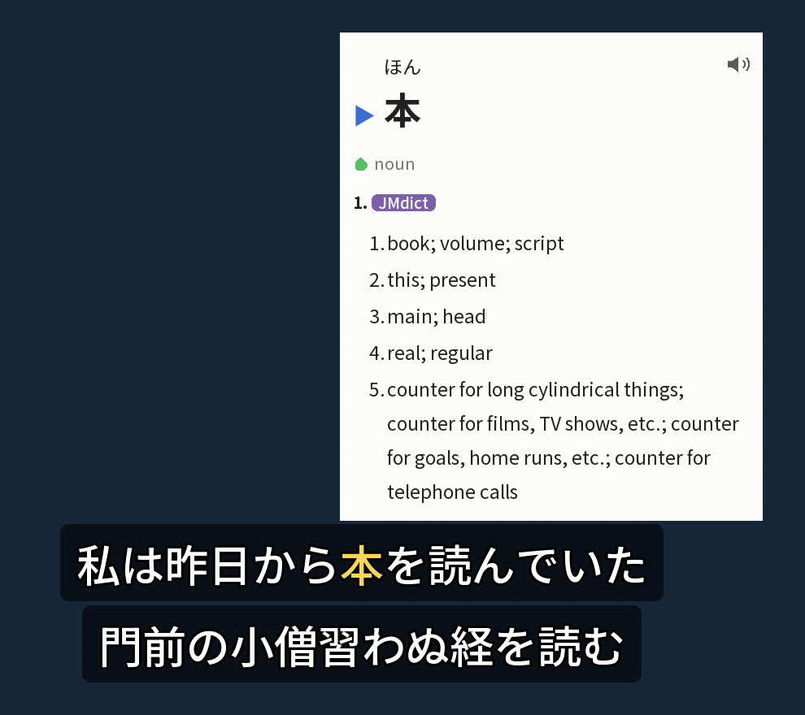

# 再点火 (Saitenka) — learn Japanese from the video you're already watching


Saitenka turns **mpv** into an immersion workstation: Japanese subtitles get **FSRS-aware word
coloring**, hovering a word opens a **Yomitan-style multi-dictionary tooltip**, and one key **mines**
the sentence — audio, screenshot, reading, pitch, frequency — straight into **Anki**. Everything is
drawn into mpv's *own* video surface, so there's no second window and none of the Windows
overlay/fullscreen breakage that plagues external overlays.



<sub>Saitenka's own overlay in demo mode — a synthetic clip and example sentence, no third-party video. The dictionary gloss is from [JMdict](https://www.edrdg.org/) © EDRDG, used under the [EDRDG licence](https://www.edrdg.org/edrdg/licence.html) (CC BY-SA).</sub>

- **再点火 = "re-ignition"** — built to make picking study back up frictionless after a long break.
- Local-first and grounded: readings and pitch always come from dictionaries, never a language model.

> **New here?** Jump to [Quick start](#quick-start) — one command installs everything and wires the
> overlay into every future mpv launch.

## Table of contents

- [Why](#why)
- [How it works](#how-it-works)
- [Features](#features)
- [Quick start](#quick-start)
- [What's in the repo](#whats-in-the-repo)
- [Requirements](#requirements)
- [Conventions](#conventions)
- [License](#license)
- [Acknowledgments](#acknowledgments)

## Why

Sentence-mining from native video is the highest-leverage way to grow vocabulary, but the usual rig is
a fragile chain of a browser texthooker, a clipboard bridge, a separate overlay window, and manual card
assembly. The overlay-window approach in particular fights the OS: on Windows it flickers, loses hover
focus, and breaks in fullscreen because a second window can never share the video's airspace.

Saitenka solves three problems:

- **No second window.** The dictionary tooltip, colored subtitles, and mining UI are composited into
  mpv's own OSD surface over its JSON-IPC connection — one surface, airspace-safe, fullscreen-safe.
- **No busywork loop.** Watch → colored subs → hover → dictionary → one-key mine (sentence audio +
  clean screenshot + reading/pitch/frequency, deduped, FSRS-tagged) happens without leaving the video.
- **Study you already forgot resurfaces.** Word coloring is sourced from your Anki/**FSRS** (Anki's
  spaced-repetition scheduler) review state, so "known" means *actually remembered right now*, and
  **N+1** sentences — those with exactly one unknown word, the ideal thing to mine — are highlighted.

## How it works

- **Renderer:** Python + [Pillow](https://python-pillow.org/) rasterizes the rich tooltip (structured
  content, ruby furigana, pitch/frequency pills, inflection chain) to a BGRA bitmap and bolts it into
  mpv via `overlay-add` over JSON IPC — no GL, no FFI, no second process drawing on screen.
- **Cross-platform IPC:** a background reader thread speaks mpv's JSON-IPC over a Unix socket
  (macOS/Linux) or a Windows **named pipe**, and *joins* a shared socket so it coexists with other mpv
  scripts.
- **Plugin mode (full-auto):** an installed `saitenka.lua` user-script makes **every** mpv launch
  auto-start the overlay in attach mode — open any video in mpv and the overlay is just there.
- **Language pipeline:** [fugashi](https://github.com/polm/fugashi) + UniDic tokenize; a Yomitan-derived
  deinflector recovers dictionary forms; lookups hit an on-disk **SQLite** index built once from your
  Yomitan dictionaries (low, near-constant RAM even for large monolingual dictionaries).
- **Free-threaded (optional):** on a free-threaded Python **3.14t** build the renderer parallelizes
  across cores; it also runs fine on a standard build (single-threaded rendering). The minimum is 3.13,
  and `uv` fetches the right interpreter for you.

## Features

- FSRS-aware subtitle **word coloring** + JLPT underlines + N+1 targeting (sourced from your Anki decks
  via AnkiConnect).
- Hover → **multi-dictionary tooltip**: ordered definitions, ruby, frequency pills, pitch-accent,
  clickable cross-references, in-tooltip word scanning, wildcard search.
- **One-key + bulk mining** to Anki (Lapis-style cards — a popular community Anki note type): sentence
  audio, clean screenshot, reading, glossary, frequency, structured provenance tags — with dedup and a
  post-mine card preview.
- On-demand **English reveal** (anti-crutch: only while you're actively looking a word up) and
  **jimaku.cc** subtitle fetch when a file has no Japanese track.
- Import dictionaries from **Yomitan** — both standard dictionary `.zip`s and a full Yomitan database
  export (streamed, so a multi-GB export never loads into memory).
- A `doctor` command that checks the whole environment and a one-command `setup` wizard.

## Quick start

**1. Install [uv](https://docs.astral.sh/uv/)** (it provides Python + all dependencies — no system
Python needed). These follow uv's [official install guide](https://docs.astral.sh/uv/getting-started/installation/):

```bash
# macOS / Linux
curl -LsSf https://astral.sh/uv/install.sh | sh
```

```powershell
# Windows (PowerShell) — upstream's standalone installer (self-updates via `uv self update`)
powershell -ExecutionPolicy ByPass -c "irm https://astral.sh/uv/install.ps1 | iex"

# …or via a package manager
winget install --id=astral-sh.uv -e   # or: scoop install main/uv
```

**2. Install Saitenka and let it set everything up.** The `setup` wizard installs mpv + ffmpeg, writes
your config, and installs the mpv plugin so **every future mpv launch auto-starts the overlay**:

```bash
# macOS / Linux
git clone https://github.com/serjflint/saitenka.git
cd saitenka
bash install/install-macos.sh          # bootstraps uv, installs the tool, runs `setup`
```

```powershell
# Windows (PowerShell) — clone, then run the bundled installer
git clone https://github.com/serjflint/saitenka.git
cd saitenka
powershell -ExecutionPolicy Bypass -File install\install-windows.ps1
```

On **Linux**, install uv (above), then from the clone run `uv tool install './overlay[full]' &&
saitenka-overlay setup` — `setup` prints your distro's `mpv`/`ffmpeg` install command (apt / dnf / pacman).

Prefer to drive it yourself? From the cloned checkout above, run `uv tool install './overlay[full]'`, then:

```bash
saitenka-overlay setup          # full-auto: inventory → install mpv/ffmpeg → config → plugin
saitenka-overlay doctor         # re-check the environment any time
saitenka-overlay install-plugin # (re)install just the auto-start mpv plugin
```

**Feature extras.** `saitenka-overlay` installs as a lean core; opt into optional features with extras
(what the installers use is `[full]`):

| Extra | Adds | License |
|------|------|--------|
| *(none)* / `[minimal]` | the bare overlay — bring your own Yomitan dictionaries | Apache-2.0 |
| `[jmdict]` | the JMdict English fallback (hover + mined-card glosses when a word isn't in your dicts) | Apache-2.0 |
| `[deinflect]` | the 🧩 inflection-chain display (Yomitan-derived) | **GPL-3.0** |
| `[full]` | everything above | **GPL-3.0** |

Mining prefers *your* dictionaries, so `[jmdict]` is only a fallback. `[deinflect]`/`[full]` pull the
GPL-3.0 add-on — a `[full]` install is therefore GPL-3.0 (see [LICENSING.md](LICENSING.md)).

**3. Watch.** With the plugin installed, open any video in mpv — the overlay attaches automatically.
Or launch a file directly:

```bash
saitenka-overlay run video.mkv          # hover a word → tooltip; Ctrl+m → mine
```

Full run/test walkthrough: **[`overlay/RUNNING.md`](overlay/RUNNING.md)**. Feature tour:
**[`overlay/README.md`](overlay/README.md)**.

## What's in the repo

- **[`overlay/`](overlay/)** — the in-mpv overlay (`saitenka-overlay`): colored subtitles, hover
  tooltip, mining, English reveal, jimaku fetch, dictionary import, `doctor`/`setup`.
- **[`tools/`](tools/)** — the Anki/FSRS deck engine: FSRS-based dictionary ranking, field
  normalization, provenance annotation, deck building, refile-by-review-state, anime chooser.
  Frequency dictionaries are user-supplied (`tools/freq/` or `--freq-dir` / `$SAITENKA_FREQ_DIR`).
- **[`install/`](install/)** — cross-platform installers (macOS / Windows / Linux), the `doctor` health
  check, and `make_bundle.py`, which builds a single self-contained zip you can hand to a friend.
- **[`deinflect/`](deinflect/)** — *optional* **GPL-3.0** add-on (`saitenka-overlay-deinflect`): the
  Yomitan-derived inflection-chain display (🧩 `-て « -いる « -た`). Kept separate so the core stays
  Apache-2.0; the overlay runs fine without it. See [LICENSING.md](LICENSING.md).

## Requirements

- **mpv** ≥ 0.37 and **ffmpeg** — `setup` installs these for you (Homebrew / winget); they don't need to
  be on `PATH` beforehand.
- **[uv](https://docs.astral.sh/uv/)** — provides the Python interpreter and dependencies.
- Optional: **[Anki](https://apps.ankiweb.net/)** + the **[AnkiConnect](https://ankiweb.net/shared/info/2055492159)**
  add-on — for FSRS-aware coloring and mining.
- Optional: **[Yomitan](https://github.com/yomidevs/yomitan)** dictionaries — import your `.zip`s (or a
  full database export) and point `overlay.toml` at them.

Every path (config, data, cache, dictionaries, the mpv binary and socket) is overridable in
`overlay.toml` or via environment variables, and resolves to platform-native locations by default.

## Conventions

Python is standardized on **`uv`** (never bare `python`/`pip`/`venv`). LLM use is optional, local-first,
and grounded — readings and pitch always come from dictionaries, never a model. There's no CI; the
pre-push gate is `uv run poe all` in `overlay/` (lint, types, tests, coverage floor 85%). See
**[AGENTS.md](AGENTS.md)** for full contributor / AI-agent guidance.

## License

**[Apache-2.0](LICENSE)** for the core (`overlay/`, `tools/`, `install/`). The optional `deinflect/`
add-on is **GPL-3.0** (derived from Yomitan) — installing it makes the *combined* work GPL-3.0. Full
map: **[LICENSING.md](LICENSING.md)**. Vendored fonts are SIL OFL; frequency and definition
dictionaries are user-supplied (not shipped).

## Acknowledgments

Saitenka stands on a lot of excellent open-source work:

- **[mpv](https://mpv.io/)** — the player, its JSON-IPC protocol, and `overlay-add`, which make the
  single-surface overlay possible.
- **[Yomitan](https://github.com/yomidevs/yomitan)** — the dictionary format, the popup UX this overlay
  reproduces, and the inflection-transform rules the optional deinflector derives from.
- **[Anki](https://apps.ankiweb.net/)** + **[AnkiConnect](https://ankiweb.net/shared/info/2055492159)**,
  and **[FSRS](https://github.com/open-spaced-repetition/fsrs4anki)** by the open-spaced-repetition
  project — the spaced-repetition backbone behind the review-state coloring.
- **[jimaku.cc](https://jimaku.cc/)** — community Japanese subtitles.
- **[fugashi](https://github.com/polm/fugashi)** + **[UniDic](https://clrd.ninjal.ac.jp/unidic/)** for
  tokenization, **[Pillow](https://python-pillow.org/)** for rendering, and
  **[JMdict/KANJIDIC](https://www.edrdg.org/)** (EDRDG) as the built-in fallback dictionary.
- Prior art that shaped the design: **[SubMiner](https://github.com/ksyasuda/SubMiner)** and the
  **[Animecards](https://animecards.site/)** workflow with **[mpv_websocket](https://github.com/kuroahna/mpv_websocket)**.
