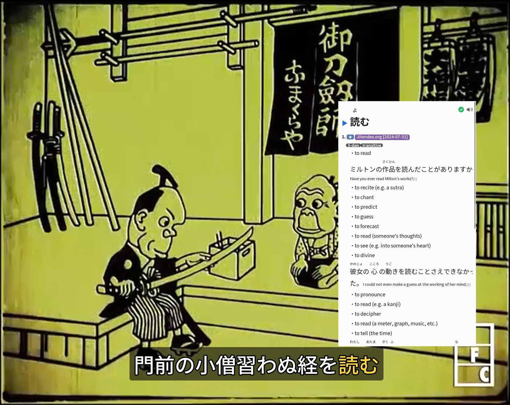

# 再点火 (Saitenka) — learn Japanese from the video you're already watching

[](https://pypi.org/project/saitenka/)


[](https://saitenka.readthedocs.io)

Saitenka turns **mpv** into an immersion workstation: Japanese subtitles get **FSRS-aware word
coloring**, hovering a word opens a **Yomitan-style multi-dictionary tooltip**, and one key **mines**
the sentence — audio, screenshot, reading, pitch, frequency — straight into **Anki**. Everything is
drawn into mpv's *own* video surface, so there's no second window and none of the Windows
overlay/fullscreen breakage that plagues external overlays.



<sub>Saitenka running on a public-domain still — *[Namakura Gatana](https://archive.org/details/kouichi-junichi-namakura-gatana-1917-4-minute-restored-version)* (なまくら刀, 1917; dir. Kōuchi Jun'ichi), restored by the National Film Archive of Japan. Open-license dictionary only ([Jitendex](https://jitendex.org), CC BY-SA); the subtitle is a demo line.</sub>

📖 **Full documentation → [saitenka.readthedocs.io](https://saitenka.readthedocs.io)** — install,
configuration, keyboard shortcuts, the CLI reference, and how it compares.

- **再点火 = "re-ignition"** — built to make picking study back up frictionless after a long break.
- Local-first and grounded: readings and pitch always come from dictionaries, never a language model.

> **New here?** Jump to [Quick start](#quick-start) — one command installs everything and wires the
> overlay into every future mpv launch.

## Table of contents

- [Why](#why)
- [How it works](#how-it-works)
- [Features](#features)
- [How it compares](#how-it-compares)
- [Quick start](#quick-start)
- [What's in the repo](#whats-in-the-repo)
- [Requirements](#requirements)
- [Conventions](#conventions)
- [License](#license)
- [Acknowledgments](#acknowledgments)

## Why

Sentence-mining from native video is the highest-leverage way to grow vocabulary, but the usual rig is a
fragile chain — a browser texthooker, a clipboard bridge, a separate overlay window, and manual card
assembly. The overlay window is the worst of it: a second window can never share the video's airspace, so
on Windows it flickers, loses hover focus, and breaks in fullscreen.

Saitenka keeps the method taught by **[TheMoeWay](https://learnjapanese.moe/animejp/)**,
**[Anacreon's mpv script](https://anacreondjt.gitlab.io/docs/mpvscript/)**, and the
**[Animecards](https://animecards.site/minefromanime/)** workflow — and removes the friction that was
still in it:

- **No second window.** Tooltip, colored subtitles, and mining UI composite into mpv's own OSD surface
  over JSON-IPC — one surface, airspace- and fullscreen-safe.
- **No busywork loop.** Watch → colored subs → hover → dictionary → one-key mine, without leaving the video.
- **Study you forgot resurfaces.** Coloring comes from your Anki/**FSRS** review state, so "known" means
  *remembered right now*, and **N+1** sentences (exactly one unknown word) are highlighted.

## How it works

Python + [Pillow](https://python-pillow.org/) rasterizes the tooltip to a bitmap and bolts it into mpv via
`overlay-add` over JSON-IPC — no GL, no FFI, no second process drawing on screen. A background thread
speaks mpv's IPC over a Unix socket or a Windows named pipe and *joins* a shared socket, so it coexists
with other mpv scripts; an installed `saitenka.lua` makes every mpv launch auto-start the overlay.
Tokenization is [fugashi](https://github.com/polm/fugashi) + UniDic with a Yomitan-derived deinflector,
over an on-disk **SQLite** index built once from your dictionaries (near-constant RAM). On a free-threaded
Python **3.14t** build the renderer parallelizes across cores (3.13 minimum; `uv` fetches the interpreter).

Full design → **[`docs/contributing/rendering.md`](docs/contributing/rendering.md)** and the
[architecture docs](https://saitenka.readthedocs.io/en/latest/contributing/architecture/).

## Features

FSRS-aware subtitle **word coloring** (JLPT underlines, N+1 targeting) · hover **multi-dictionary tooltip**
(ordered definitions, ruby, pitch-accent with devoiced/nasal markers, frequency pills, inline images incl.
SVG gaiji, clickable cross-refs, wildcard search) · a **kanji panel** (Yomitan-parity KANJIDIC sections +
stroke-order headword) · **one-key + bulk mining** to Anki (Lapis-style cards, still or motion clip,
optional word audio, dedup, post-mine preview) · **second-language reading profiles** (a French profile
ships today) · JP/EN reveal controls · whole-episode **subtitle panel** + playback-neutral analysis +
opt-in session history · background subtitle fetch (**jimaku.cc**, opt-in TsukiHime) · automatic **resync**
(alass) · **Yomitan** dictionary import (streamed) · `doctor`/`setup`/`config`. Watch-party-safe: study
actions never pause or seek a Syncplay room.

📖 **Full tour with keys and screenshots → [Features](https://saitenka.readthedocs.io/en/latest/usage/features/)**
· [keyboard shortcuts](https://saitenka.readthedocs.io/en/latest/usage/shortcuts/).

## How it compares

Saitenka, **[SubMiner](https://github.com/ksyasuda/SubMiner)**,
**[Autocards](https://learnjapanese.moe/autocards/)**, and
**[Anki Miner](https://github.com/0xzerolight/anki_miner)** get Japanese vocabulary from video into Anki,
while **[Migaku](https://migaku.com/)** spans streaming video, web reading, mobile OCR, and its own study
system. Five different angles: Saitenka is a **grounded, FSRS-driven engine composited inside mpv's own
surface**; SubMiner a **feature-broad Electron app**; Autocards a **retroactive back-filler**; Anki Miner
a **batch-mining desktop GUI**; Migaku a **commercial browser-and-mobile immersion platform**. Trade-offs
across different jobs, not a scoreboard.

**Why reach for Saitenka:** a fast, single-surface engine that draws straight into mpv — no second window,
fullscreen/airspace-safe; **live FSRS review-state coloring** so forgotten words resurface and **N+1**
sentences are highlighted; a multi-dictionary Yomitan tooltip; and one-key + bulk mining, all grounded
(readings/pitch from dictionaries, never an LLM).

📊 **Full capability matrix, adjacent mobile immersion tools, and where Saitenka fits in a media-server / watch-tracking rig →
[Why Saitenka → How it compares](https://saitenka.readthedocs.io/en/latest/why/comparisons/).**

## Quick start

**1. Install.** The standalone installer bootstraps [`uv`](https://docs.astral.sh/uv/), installs
`saitenka[full]` from PyPI, and runs the `setup` wizard — no clone, no prerequisites:

```sh
# macOS / Linux
curl --proto '=https' --tlsv1.2 -LsSf https://serjflint.github.io/saitenka/install.sh | sh
```

```powershell
# Windows (PowerShell)
powershell -ExecutionPolicy ByPass -c "irm https://serjflint.github.io/saitenka/install.ps1 | iex"
```

> Prefer to read it first? Download and inspect before running:
> `curl --proto '=https' --tlsv1.2 -LsSf https://serjflint.github.io/saitenka/install.sh -o install.sh`,
> then `less install.sh && sh install.sh`.

Already have `uv` (or `pipx`)? Skip the script and install from **PyPI** directly:

```sh
uv tool install "saitenka[full]"        # or: pipx install "saitenka[full]"
saitenka setup                          # mpv + ffmpeg, config, and the auto-start mpv plugin
```

The `setup` wizard installs **mpv + ffmpeg** (or prints your distro's install command) and the mpv
plugin so **every future mpv launch auto-starts the overlay**.

**2. Watch.** Open any video in mpv — the overlay attaches automatically. Or launch a file directly:

```sh
saitenka run video.mkv          # hover a word → tooltip; Ctrl+m → mine
```

**3. Update & maintain.** `update` upgrades to the latest, keeping your extras (like `uv self update`):

```sh
saitenka update                 # upgrade to the latest, extras preserved (wraps uv tool upgrade)
saitenka doctor                 # re-check the whole environment any time
saitenka setup                  # re-run the setup wizard (mpv/ffmpeg, config, plugin)
saitenka install-plugin         # (re)install just the auto-start mpv plugin
```

**Feature extras.** `[full]` bundles `deinflect` + `jmdict` + `telemetry`; `images`, `layout-engine`, and
`linux-keyring` stay explicit (add them alongside, e.g. `saitenka[full,images]`). `update` keeps whatever
you have. To change the set, `uv tool install --reinstall "saitenka[<extra>]"`:

| Extra | Adds | License |
|------|------|--------|
| *(none)* / `[minimal]` | the bare overlay — bring your own Yomitan dictionaries | Apache-2.0 |
| `[jmdict]` | the JMdict English fallback (hover + mined-card glosses when a word isn't in your dicts) | Apache-2.0 |
| `[deinflect]` | the 🧩 inflection-chain display (Yomitan-derived) | **GPL-3.0** |
| `[images]` | inline dictionary images, incl. SVG gaiji (resvglite) | Apache-2.0 |
| `[layout-engine]` | optional Rust flexbox tooltip layout backend (taffylite) | Apache-2.0 |
| `[telemetry]` | OpenTelemetry spans/metrics for performance observability | Apache-2.0 |
| `[linux-keyring]` | Linux Secret Service storage for the jimaku key on Python 3.15+ | Apache-2.0 |
| `[full]` | `[deinflect]` + `[jmdict]` + `[telemetry]` | **GPL-3.0** |

Mining prefers *your* dictionaries, so `[jmdict]` is only a fallback. `[deinflect]`/`[full]` pull the
GPL-3.0 add-on — a `[full]` install is therefore GPL-3.0 (see [LICENSING.md](LICENSING.md)). On Linux,
Python 3.13/3.14 install Secret Service support by default; Python 3.15+ uses `JIMAKU_API_KEY` or an
owner-only `$XDG_CONFIG_HOME/saitenka/jimaku.key` unless `[linux-keyring]` is installed, avoiding its
`cryptography` dependency.

Full docs: **[saitenka.readthedocs.io](https://saitenka.readthedocs.io)** (install, usage,
[development](https://saitenka.readthedocs.io/en/latest/contributing/development/)). Renderer design:
**[`docs/contributing/rendering.md`](docs/contributing/rendering.md)**.

## What's in the repo

- **[`src/saitenka/`](src/saitenka/)** — the in-mpv application: colored subtitles, hover
  tooltip, mining, English reveal, jimaku fetch, dictionary import, `doctor`/`setup`.
- **[`tools/`](tools/)** — the Anki/FSRS deck engine: FSRS-based dictionary ranking, field
  normalization, provenance annotation, deck building, refile-by-review-state, anime chooser.
  Frequency dictionaries are user-supplied (`tools/freq/` or `--freq-dir` / `$SAITENKA_FREQ_DIR`).
- **[`install/`](install/)** — the cross-platform install scripts (`overlay-install.{sh,ps1}`, served
  from GitHub Pages) and the release helper (`release.py`).
- **[`deinflect/`](deinflect/)** — *optional* **GPL-3.0** add-on (`saitenka-deinflect`): the
  Yomitan-derived inflection-chain display (🧩 `-て « -いる « -た`). Kept separate so the core stays
  Apache-2.0; the overlay runs fine without it. See [LICENSING.md](LICENSING.md).

## Requirements

- **mpv** ≥ 0.37 and **ffmpeg** — `setup` installs these for you (Homebrew / winget); they don't need to
  be on `PATH` beforehand.
- **[uv](https://docs.astral.sh/uv/)** — provides the Python interpreter and dependencies.
- Optional: **[Anki](https://apps.ankiweb.net/)** + the **[AnkiConnect](https://ankiweb.net/shared/info/2055492159)**
  add-on — for FSRS-aware coloring and mining.
- Optional: **[Yomitan](https://github.com/yomidevs/yomitan)** dictionaries — import your `.zip`s (or a
  full database export) and point `overlay.toml` at them.

Every path (config, data, cache, dictionaries, the mpv binary and socket) is overridable in
`overlay.toml` or via environment variables, and resolves to platform-native locations by default.

## Conventions

Python is standardized on **`uv`** (never bare `python`/`pip`/`venv`). LLM use is optional, local-first,
and grounded — readings and pitch always come from dictionaries, never a model. CI mirrors the
root-level `uv run poe all` pre-push gate (lint, types, tests, coverage floor 85%). See
**[AGENTS.md](AGENTS.md)** for full contributor / AI-agent guidance.

## License

**[Apache-2.0](LICENSE)** for the core (`src/saitenka/`, `tools/`, `install/`). The optional `deinflect/`
add-on is **GPL-3.0** (derived from Yomitan) — installing it makes the *combined* work GPL-3.0. Full
map: **[LICENSING.md](LICENSING.md)**. Vendored fonts are SIL OFL; frequency and definition
dictionaries are user-supplied (not shipped).

## Acknowledgments

Saitenka stands on a lot of excellent open-source work:

- **[mpv](https://mpv.io/)** — the player, its JSON-IPC protocol, and `overlay-add`, which make the
  single-surface overlay possible.
- **[Yomitan](https://github.com/yomidevs/yomitan)** — the dictionary format, the popup UX this overlay
  reproduces, and the inflection-transform rules the optional deinflector derives from.
- **[Anki](https://apps.ankiweb.net/)** + **[AnkiConnect](https://ankiweb.net/shared/info/2055492159)**,
  and **[FSRS](https://github.com/open-spaced-repetition/fsrs4anki)** by the open-spaced-repetition
  project — the spaced-repetition backbone behind the review-state coloring.
- **[jimaku.cc](https://jimaku.cc/)** — community Japanese subtitles.
- **[fugashi](https://github.com/polm/fugashi)** + **[UniDic](https://clrd.ninjal.ac.jp/unidic/)** for
  tokenization, **[Pillow](https://python-pillow.org/)** for rendering, and
  **[JMdict/KANJIDIC](https://www.edrdg.org/)** (EDRDG) as the built-in fallback dictionary.
- Prior art that shaped the design: **[SubMiner](https://github.com/ksyasuda/SubMiner)** and the
  **[Animecards](https://animecards.site/)** workflow with **[mpv_websocket](https://github.com/kuroahna/mpv_websocket)**.
  The immersion guides that inspired the project are credited in [Why](#why).
